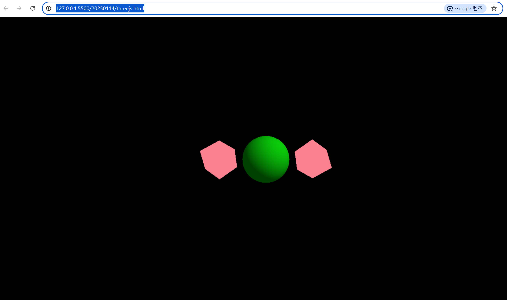

## 당일 진행한 개인 활동 요약

- 인터넷 글을 참고하여 three.js 공부 진행
- three.js를 이용하여 3d 공간 상에서 큐브 회전 동작, 구 생성을 진행해봄

## 소스 코드 결과 이미지



## 소스 코드 확인

threejs.html

(\*threejsrand.html은 chatGPT에게 요청하여 받은 파일로, 스스로 작성하지 않은 자동화 파일로 학습 소스코드가 아니므로 제외하였습니다. 추후 주석을 달며 분석해보고 싶은 코드이기에 분석용으로 남겨두었습니다. 다만 동작에 일부 오류가 있는 상태이기 때문에 나중에 이 원인도 파악할 수 있다면 좋을 것 같습니다.)

```
<!DOCTYPE html>
<html>
  <head>
    <meta charset="utf-8" />
    <title>three.js 연습</title>
    <style>
      body {
        margin: 0;
      }
      canvas {
        display: block;
      }
    </style>
  </head>
  <body>
    <canvas class="webgl"></canvas>

    <script src="https://cdnjs.cloudflare.com/ajax/libs/three.js/r128/three.min.js"></script>

    <script>
      //참고 글
      // https://velog.io/@9rganizedchaos/Three.js-journey-%EA%B0%95%EC%9D%98%EB%85%B8%ED%8A%B8-01-03
      // https://velog.io/@9rganizedchaos/Three.js-journey-%EA%B0%95%EC%9D%98%EB%85%B8%ED%8A%B8-12
      // https://pink1016.tistory.com/297
      // ㄴreact를 아직 안 배웠기 때문에 구의 style만 참고
      // https://velog.io/@greencloud/Three.js%EC%99%80%EC%9D%98-%EC%84%A4%EB%A0%88%EB%8A%94-%EC%B2%AB%EB%A7%8C%EB%82%A8-
      // ㄴ큐브 생성

      // canvas
      const canvas = document.querySelector("canvas.webgl");

      //ThreeJS의 기본 요소 네 가지
      // - scene
      // - objects
      // - camera
      // - renderer

      // Scene 생성
      const scene = new THREE.Scene();

      // Object 만들기
      // 1. geometry와 meterial을 각각 생성
      // 2. mesh를 이용해서 둘을 결합
      // 3. 결합한 mesh를 scene에 추가(추가해야 눈으로 확인할 수 있다)

      // Object를 만들기 위한 material 종류
      // - MeshBasicMaterial : 가장 기본
      // - MeshNormalMaterial : .메쉬의 법선 벡터를 시각적으로 표현하는 재질
      // - MeshMatcapMaterial : Matcap 텍스처로 정의되는 것, 가까 빛 등을 꾸며내기 좋음
      // - MeshDepthMaterial : 카메라와의 거리에 따라 geometry를 흑백으로 채색함
      // - MeshLambertMaterial : 빛에 반응하는 material, 매개변수가 복잡함
      // - MeshPhongMaterial : MeshLambertMaterial과 비슷, 빛의 반사 반영 가능, MeshLambertMaterial에 비해 성능이 떨어지지만, 이상한 패턴이 덜 보인다
      // - MeshToonMaterial : MeshLambertMaterial과 비슷하지만, 카툰 스타일에 해당함
      // - MeshStandardMaterial : MeshLambertMaterial 및 MeshPhongMaterial처럼 조명 지원. 다른 두 material보다 현실적인 알고리즘/거칠기 및 금속성 매개변수를 사용. PBR이 적용된다는 특징
      // - MeshPhysicalMaterial : MeshStandardMaterial과 같지만, clear coat 효과 지원
      // - PointsMaterial : 입자 material
      // - ShaderMaterial and RawShaderMaterial : 나만의 material

      const geometry = new THREE.BoxGeometry(1, 1, 1); //1-1
      const material = new THREE.MeshBasicMaterial({ color: 0xfb8191 }); //1-2
      //html css color 선택에 도움 되는 사이트: https://www.htmlcsscolor.com/

      // 1번 큐브
      const cube = new THREE.Mesh(geometry, material); //2
      cube.position.x = -2; //두 번째 큐브와 안 겹치게 왼쪽으로 이동시킴
      scene.add(cube); //3

      // 2번 큐브
      const cube2 = new THREE.Mesh(geometry, material); //2
      cube2.position.x = 2; //첫 번째 큐브와 안 겹치게 오른쪽으로 이동시킴
      scene.add(cube2); //3

      // 구
      const sgeometry = new THREE.SphereGeometry(1, 32, 32); // 반지름 1, 세그먼트 32 x 32
      const smaterial = new THREE.MeshPhongMaterial({
        color: 0x00ff00, // 기본 색상
        shininess: 0, // 빛의 강도
        specular: 0x555555, // 하이라이트 색상
      });
      const sphere = new THREE.Mesh(sgeometry, smaterial);
      scene.add(sphere);

      // 카메라
      // 여러 타입이 있지만, 우선은 Perspective Camera를 사용(연습을 위해 기본 카메라를 쓴다)

      //perspective Camera는 두 개의 필수 인자를 필요로 한다
      // 1. the field of view, 즉 시야각.
      //    큰 앵글을 쓰면 모든 방향을 한 번에 볼 수 있지만 왜곡이 생긴다
      //    작은 앵글을 쓰면 사물이 확대된 것처럼 보인다
      //    * 사람의 시야와 유사한 건 75도 정도
      // 2. The aspect ratio
      //    보통 aspect ratio는 캔버스의 너비를 높이로 나눈 값에 해당한다

      const size = {
        width: window.innerWidth,
        height: window.innerHeight,
      };
      const camera = new THREE.PerspectiveCamera(
        75, //시야각
        size.width / size.height, //화면 비율
        0.1,
        1000
      );
      scene.add(camera);

      // renderer: 렌더링해주는 것
      // 렌더링을 해야 눈으로 정말 볼 수 있다다
      const renderer = new THREE.WebGLRenderer({
        canvas: canvas,
      });

      renderer.setSize(size.width, size.height); //setSize 메서드로 canvas의 크기를 조정함

      //카메라 위치 수정
      camera.position.z = 8;
      // 카메라의 위치를 설정하는 코드이다
      // 카메라가 3D 공간에서 얼마나 앞쪽 혹은 뒤쪽으로 배치될지를 결정한다
      // position.z의 숫자가 클수록 물체가 멀어진다, 0이면 안 보인다

      // 광원 추가
      const ambientLight = new THREE.AmbientLight(0x404040, 1); // 약한 배경 조명
      scene.add(ambientLight);
      const directionalLight = new THREE.DirectionalLight(0xffffff, 0.5); // 강한 방향성 조명
      directionalLight.position.set(5, 5, 5).normalize();
      scene.add(directionalLight);

      //화면이 새로고침될 때마다 렌더링됨
      function animate() {
        requestAnimationFrame(animate); //주요 기능: 유저가 브라우저 창을 이탈하면 렌더링을 멈춘다

        // 큐브 회전 동작
        cube.rotation.x += 0.01; //상하 회전, +이기 때문에 아래로 돈다
        cube.rotation.y += 0.01; //좌우 회전, +이기 때문에 오른쪽으로 돈다
        cube2.rotation.x -= 0.01; //상하 회전, -이기 때문에 위로 돈다
        cube2.rotation.y -= 0.01; //좌우 회전, +이기 때문에 왼쪽으로 돈다

        renderer.render(scene, camera); //실제 렌더링
      }

      animate();

      // 화면 크기 변경 시 처리
      window.addEventListener("resize", () => {
        // 화면 크기 업데이트
        size.width = window.innerWidth;
        size.height = window.innerHeight;

        // 렌더러 크기 변경
        renderer.setSize(size.width, size.height);

        // 카메라 비율 업데이트
        camera.aspect = size.width / size.height;
        camera.updateProjectionMatrix(); // 카메라 프로젝션 매트릭스 업데이트
      });
    </script>
  </body>
</html>

```
