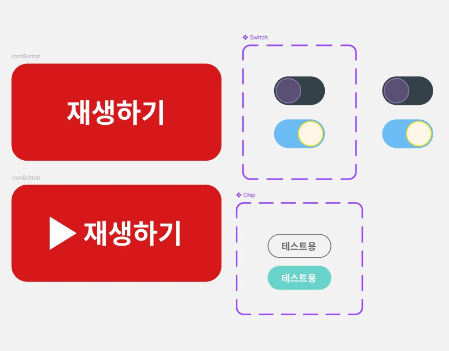
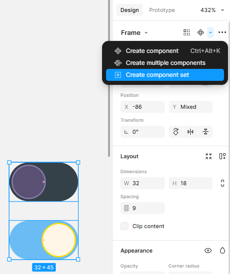
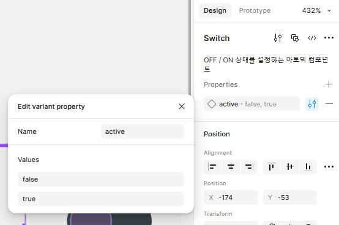
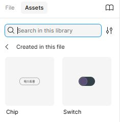
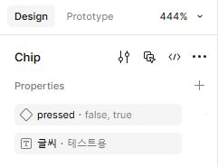
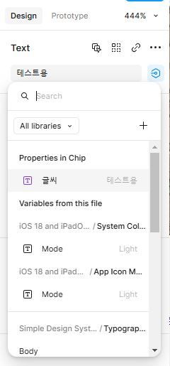
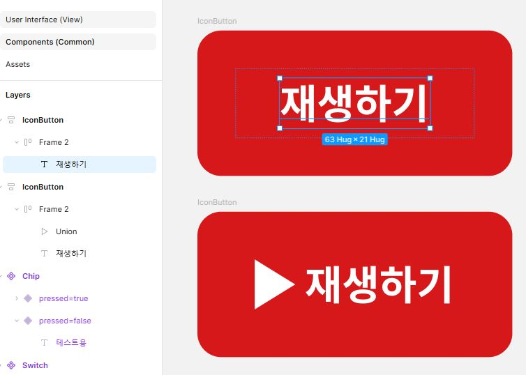

## 당일 진행한 개인 활동-figma 요약

UI/UX 개발친화 특강에 따라 figma 실습 진행. 디자인에서 UX개발 워크 플로우를 배움.

## 진행 결과

## 진행한 내용

야무 강사 님의 모듈형 특강 1회차 수강

- 두 가지 정신적 디자인 모델을 배움.

  - 첫 번째는 CDD로, 컴포넌트 중심의 디자인/설계.
  - 두 번째는 아토믹 디자인으로, 추상적인 작은 단위의 원소를 조립하여 분자를 만들고, 분자가 조직적으로 커지며 유기체가 되는 모습을 컴포넌트에 비유함. CDD의 연장선으로 학습.

    이 컴포넌트를 조직하는 방식으로 틀(template)를 만든 뒤 데이터를 입력하면 비로소 실제 사용자가 쓰는 interface, page가 됨

  - 두 모델은 모두 '정신적' 모델에 해당하므로, 위 모델을 절대적으로 따르기보다는 두 모델을 기반으로 수정해나가면서 디자인 작업을 하게 됨

### 실제 실습

---

#### 1. Switch 컴포넌트 제작

- Frame을 만든 뒤, 내부에 원형 요소를 추가하여 컴포넌트 모양을 제작.
- 위에서 만든 것을 복제하여 on/off 형태로 두 가지 형태 제작
- 위에서 제작한 두 형태의 Frame을 선택하여 component로 바꿈
  
- 생성한 컴포넌트에서 properties를 true/false로 지정(알아볼 수 있다면 다른 value도 가능)
  
- assets에서 사용 가능하게 됨(완성)
  

#### 2. Chip 컴포넌트 제작

- Frame을 만든 뒤, 내부에 텍스트 요소를 추가하여 컴포넌트 모양을 제작
- 제작한 요소를 선택하여 우클릭한 뒤 add auto layout을 진행, 이것으로 텍스트가 중앙 정렬됨
- 만들어진 디자인 요소를 복제하여 click 했을 때는 다른 색상이 되도록 두 형태의 Chip 디자인을 생성
- 두 개를 선택하여 Switch 때처럼 create component set 해줌
- 필요한 properties인 pressed(true/false), 글씨를 지정해줌(pressed 등 글자는 다른 알아볼 수 있는 것으로 지정해도 괜찮음)
  
- 글씨를 연동(\* 이 부분을 놓쳐서 한참 헤맸는데, 직접 텍스트에 가서 properties를 선택하여 연동해주어야 했음)
  
- Switch와 마찬가지로 assets에 등록되어 사용 가능해짐

> 강의 후 검색해본 결과 chip은 radio와 같이 기능하도록 사용할 수 있는 듯함. 이외에도 다양하게 활용 가능.

#### 3. 스스로 IconButton 제작 미니 과제 진행

- 예시 이미지를 보고 수업 이후 각자 알아서 직접 만들어 보는 과제가 주어짐
- 아래와 같이 icon과 글자를 하나의 Group으로 묶고 auto layout을 생성하여 정렬한 뒤, 그것을 다시 auto layout으로 정렬하는 것으로 디자인 요소를 제작해 봄
  
- 이후 component를 제작하여 아이콘을 보였다 숨겼다 하는 기능은 아직 배우지 않았기 때문에 목요일에 이어서 진행 예정

## 새롭게 알게 된 내용

- figma를 사용하면 component를 만들어서 CDD 형식의 디자인을 수행할 수 있다
- 컴포넌트 mode를 Dark로 바꾸면 색상을 Light모드에서 Dark모드로 바뀌게 할 수도 있다
- 컴포넌트를 생성하면 이후 해당 컴포넌트를 재사용한 디자인 내역을 일일이 수정할 필요 없이 컴포넌트만 수정하면 다른 곳에는 자동 반영된다
