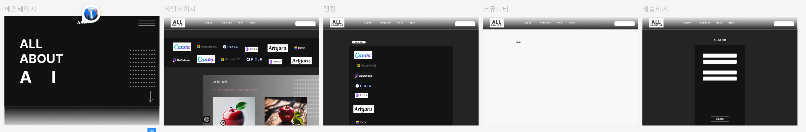
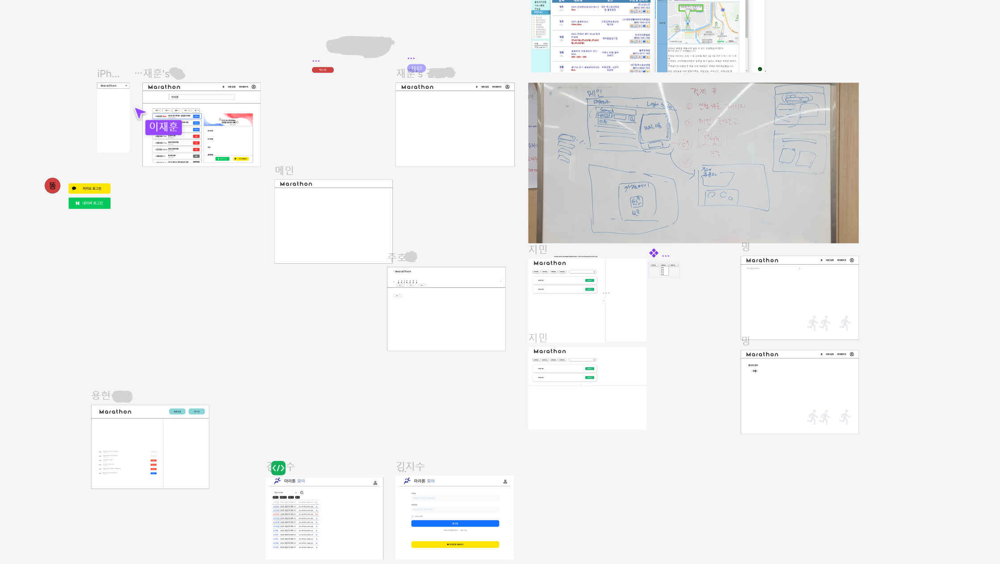
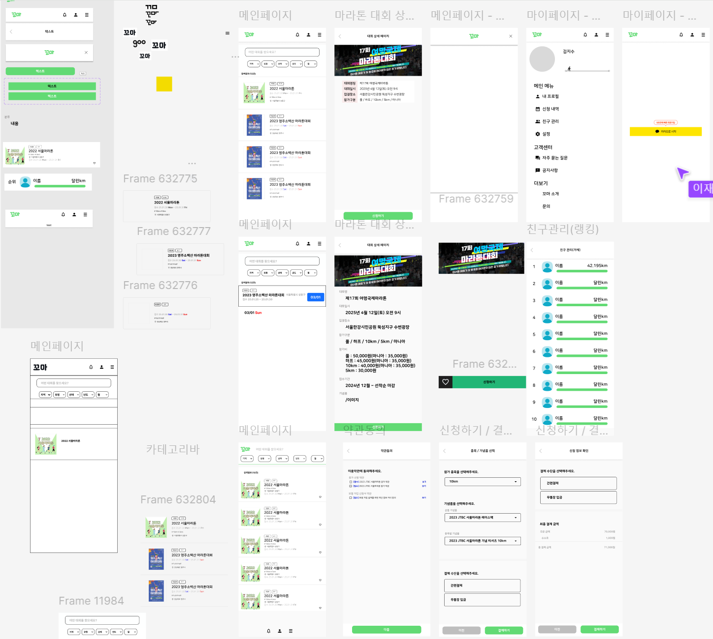
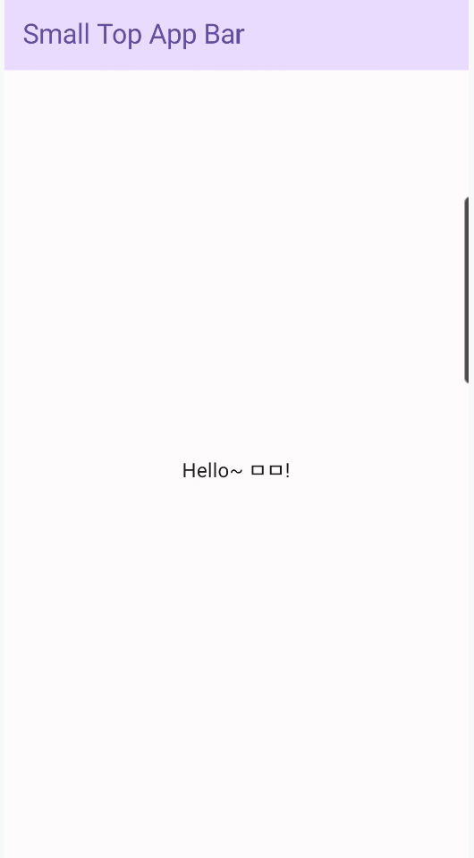
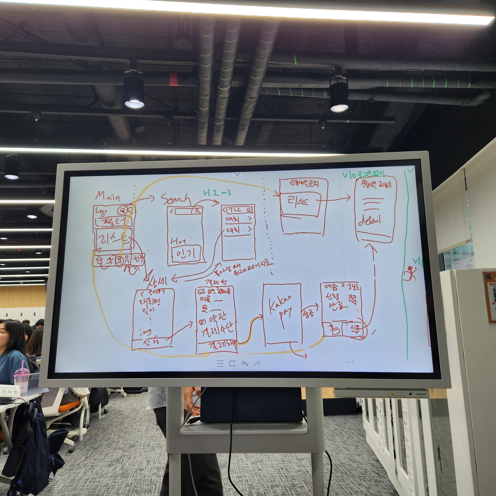
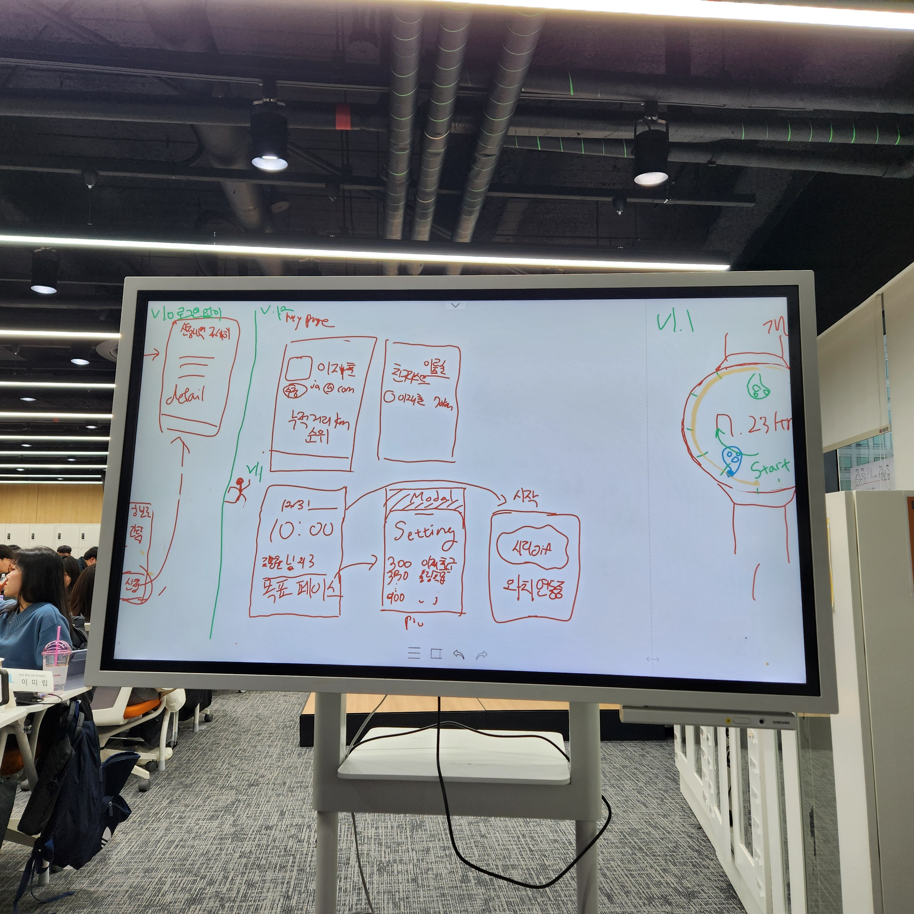
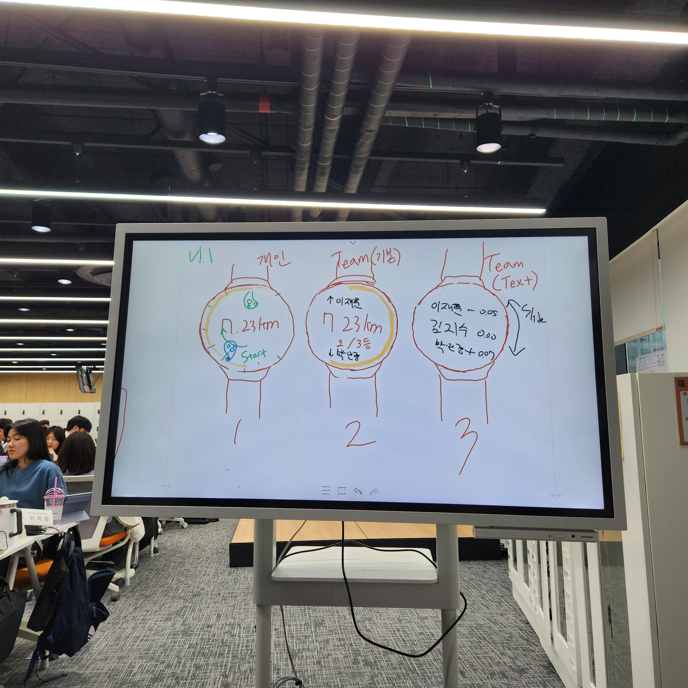
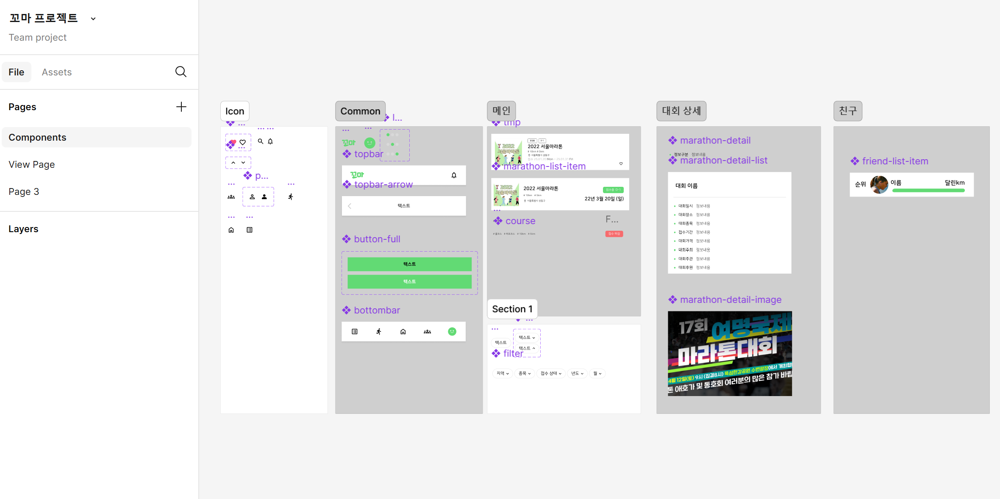

## 인적사항

- 백지민
- 12기 서울 8반(2학기 기준)
- 학번: 1246090

## commit 내용 기록

### 2025-01-14-tuesday

---

- three.js 공부 진행 (\*개인 활동 세부 내용 20250114 폴더 내부에 존재)
- figma UI/UX(개발친화) 특강 공부 (\*개인 활동 세부 내용 20250114 폴더 내부에 존재)
- 단체 프로젝트 기획 회의 진행

#### 어제 나눈 아이디어 관련 논의::

자립준비청년(보육원으로부터 독립을 하려는 청년)을 위한 서비스

- 서비스 대상이 많지 않다는 문제 존재
- 서비스에 지속성이 없음

-> 문제 해결을 위해 자료를 찾아본 결과 자립준비청년의 실질적인 수가 많지 않다는 것을 발견

[자립준비청년 관련 자료 url](https://www.mohw.go.kr/board.es?mid=a10411010300&bid=0019&act=view&list_no=1481704)

-> 정보를 제공하는 웹 페이지는 '잘 만들어진 블로그'를 벗어나기 힘들다는 의견, 개발에 들이는 시간보다 정보 찾기에 들이는 시간이 길어질 것 같다는 우려 존재

-> 결론적으로 자립준비청년을 위한 웹 서비스는 진행하지 않는 방향으로 이야기를 마침, 이후 새로운 아이디어 논의 진행

#### 새로 나온 아이디어::

- 알파남 만들기: 호감 있는 이성과 대화할 때 호감을 끌 수 있을 만한 방향을 제시해주는 서비스
- 캘린더를 적으면 그것을 모아 꾸밀 수 있는 캘린더 웹 페이지

- 대리 여행 가주는 서비스
- 꿈을 사고 파는 서비스 (three.js를 이용한 3D UI/UX에 대한 흥미가 높게 논의되었음)

-> 이후 가장 흥미롭게 이야기를 나눈 꿈 구매/판매 서비스로 컨설턴트 님께 문의 드림

#### 컨설턴트 님의 의견::

! 흥미로우나, 왜 꿈을 팔아야 하는지 등 타당성이 부족하다

-> 초기부터 지속적으로 제기된 문제로, 보다 사용자 관점에서 기획할 수 있도록 신경 쓰도록 노력해야겠다고 생각했다. 하지만 사용자가 원하는 것을 찾으려면 사용자 분석을 면밀히 해야 할 텐데, 짧은 기획 시간 동안 이것을 어떻게 하면 좋을지 고민이 크다.

#### 내일 해야 할 일

어떻게 하면 사용자 중심으로 필요한 기능이 들어간 웹 서비스를 만들 수 있을지 다시 아이디어/기획 회의를 진행해야 할 듯하다.

### 2025-01-15-wednesday

---

- react 공부 진행 (\*개인 활동 세부 내용 20250115 폴더 내부에 존재)
- 단체 프로젝트 기획 회의 진행, 아이디어 구체화를 위한 figma 작업

#### 기획 회의 내용

여러 의견이 나왔지만, 가장 정리된 아이디어로는 아래 두 가지가 있었다.

- All About AI
  - 인터넷 곳곳에 퍼져 있는 AI 정보를 한곳에 모아놓은 사이트
    
- WorkLog
  - 혼자만으로는 달성하기 힘든 목표를, 다 함께 공유하면서 동기를 얻을 수 있도록 그룹 캘린더를 제공해주는 사이트
  - 킥이 될 만한 기능이 필요할 것 같다는 의견 존재

#### 컨설턴트 님의 의견::

! 아이디어를 생각하기보다 '기획'을 해 볼 것.

아이디어는 크게 중요하지 않다.

- 위 두 가지 아이디어를 들고 간 뒤, 보다 사용자가 써야 하는 이유를 생각해 보고 '기획'을 하라는 의견을 받았다.

  이에 이전까지는 기획에 있어서 새로운 아이디어를 어떻게 낼지에 대해 치중했다는 것을 깨달았다. 그에 따라 앞으로는 더욱 사용자 중심의, 사용자가 어떠한 이유를 가지고 쓰게 되는 서비스를 기획하도록 더욱 신경 쓰기로 결론 내렸다.

### 2025-01-16-thursday

---

- 단체 프로젝트 기획 회의 진행

#### 기획 회의 내용

- 코치 님의 조언에 따라 공통 관심사를 찾아보자는 의견이 제시
- 함께 이야기를 나눠보았지만, 논의가 잘 진척되지 않아 함께 바깥 공기를 쐬며 환기하는 시간을 가짐
- 이후 각자가 평소 느낀 불편한 점을 생각해 보다가 마라톤 신청이 불편하다는 의견이 나옴
- 이후 현재 불편한 마라톤의 신청 및 결제를 한번에 해주는 통합 서비스를 제안

- 도중에 기획에 힌트를 얻기 위해 강의 추가 시청

```
[주제 선정 방법]

-듣는 사람에게 공감이 가는 주제로 프로젝트 진행함
-평소 자신이 불편하다고 생각했던 주제
ㄴ듣는 사람이 공감할 수 있는 주제
ㄴ팀원들이 해당 주제에 대한 지식이 없어도, 본인이 충분히 설명할 수 있는 소재
ex) 희귀 동물 관심, 희귀 동물을 거래하고 양도 양수하려면 특별한 서류가 필요한데, 밀수 개체 거래가 종종 발생. 동물을 투명하게 관리하기 위해 블록체인으로 투명성, 무결성을 보장함.
-최근 사회적으로 이슈가 되고 있는 문제, 사회적 문제를 해결할 수 있는 CSR 관려녀 아이디어
ex) 공황장애 이슈 > 공황발작 예측과 대처를 위한 훈련을 도와주는 서비스
워치, 디바이스 이용
-주변 사람이 겪고 있는 문제
ㄴ가까운 사람의 문제를 해결할 수 있는 주제
ㄴ설문, 인터뷰를 산출물에 포함한다면 신뢰도 향상
-유치원 교사 겪는 고충 설문
-유치원 교사 업무 효율 높이고, 학부모 간 소통 도와주는 서비스


'이 서비스 이미 있는데요?' 라는 생각에 대하여
ㄴ세상에 없는 서비스를 만드는 것도 좋지만, 이에 집착할 필요는 없음

ex. 스카이프는 원조 음성채팅 서비스이지만, 커뮤니티 기능을 추가한 디스코드는 스카이프를 뛰어넘었다

>기존 서비스에 아이디어를 추가해서 서비스 품질을 향상하는 것도 좋음


[프로젝트 주제 선정까지 거쳐야 하는 과정]

-충분한 협의 후 주제 선정하기(팀원이 같은 목표를 바라봐야 함)
-태도, 반대 의견을 낼 때는 부드럽게 하면서 대안도 꼭 제시하기, 쿠션어 활용 생활화
-프로젝트 기간을 충분히 고려하여 주제를 선정


[프로젝트 볼륨 키우는 법]

-AI를 적극적으로 활용: STT, 얼굴인식 등..
-사용자 중심의 서비스 설계


[주의사항]

-프로젝트 주제 선정시 주의할 부분
ㄴ오로지 기술 사용만을 위한 주제 선정은 지양
ㄴ새로운 기술을 학습하는 걸 두려워하지 말자

```

#### 컨설턴트 님의 의견::

! 좋다. 하지만 '마라톤'이라는 주제에 쓰기에 다소 아까운 기획이다. 다른 주제를 찾아 보는 것도 좋겠다. 만약 마라톤을 유지할 것이라면 UI/UX를 정말 신경 써서 해 볼 것.

#### 이후 추가 논의

- '마라톤'이라는 주제를 기본으로 두되, 새로운 주제도 각자 자료조사해온 뒤 추가 논의해보자는 의견
- 내일은 도메인 지정 및 기능 구체화 진행토록 계획

### 2025-01-17-friday

---

- 단체 프로젝트 기획 회의 진행
- 단체 프로젝트 구체화 회의 진행

#### 오늘의 할 일 계획

✅ 도메인 찾아보기

✅ 기획 구체화하기

✅ 자료 찾아보기

#### 도메인 찾아보기 내용

- 통합 결제 서비스를 제공할 주제를 찾아보았으나, 마라톤 이외에는 이미 제공되는 서비스가 존재함을 확인하였음
- 마라톤을 위한 서비스로 유지하기로 결정

\* 자세한 자료조사 내용은 아래를 참고

[자료조사 정리 노션](https://www.notion.so/Marathon-4fe881799567481da50ed837459b44db)

#### 기획 회의 내용

- figma로 상상하는 페이지 구현 진행
  
- 결제를 진행한 뒤 완료 확인을 어떻게 하면 좋을지 고민 > 완료되었다는 안내 페이지의 출력
- 결제 이후 환불할 때의 로직 관련 이야기를 나눔

#### 컨설턴트 님의 의견

! 기획 단계에서 킥으로 내세운, 결제를 간편하게 하는 서비스는 2~7일 정도면 구현이 가능할 듯

더욱 사용자가 마라톤을 하면서 계속 사용할 수 있는 서비스를 기획하기 위해 의견을 나눠 봐야 할 것

#### 구체화 회의 내용

- 컨설턴트 님께서 마라톤을 할 때 차고 있던 워치로 친구의 위치를 확인한다거나, 경쟁 기능 등을 제안해주셨기 때문에 검토. 웹에서 워치로 알림을 줄 수 있는지 정보 검색. 앱이 아니라면 힘들 것 같다는 의견. 카카오톡으로 알림을 전송해주는 정도라면 가능할 것이라는 의견
- 이 외에도 실질적으로 사용자가 필요로 하는 기능이 무엇일지 고민함. 이에 설문조사를 작성하여 배포하도록 계획함.

### 2025-01-20-monday

- 프로젝트 명 회의 후 '꼬마'로 결정
  > go go marathon의 줄임말

* 본래 웹 개발을 하려고 했으나, 컨설턴트 님의 피드백으로 앱 개발로 진행해도 됨을 확인
* 앱 개발로 진행 변경, 워치 연동 고려 시작

* 기획 정리를 위한 figma 작업 진행
  

### 2025-01-21-tuesday

- 코치 님의 데일리 코칭 수강

  - UI 레퍼런스 찾는 곳: 핀터레스트, notefolio, figma community 등
    figma community는 해당 프레임 레이아웃까지 가져와서 작업할 수 있는 경우도 있음

  - UX를 찾고 싶을 때는 유저 스푼을 사용하고 있음

  - 피그마 플러그인 추천 : Background remover, 사진 background 바로바로 없애서 쓸 수 있음

  - Plugin을 많이 활용하면 좋음

    - Icon 플러그인 추천: Phospher Icons 플러그인, React Icons 플러그인

  - [와이어프레임 체크리스트]

    - 필요한 기능들이 포함되어 있는가?
    - 와이어프레임 바탕으로 필요한 데이터와 API를 작성하자!
    - 해당 데이터를 어떻게 저장하고, 관리할지
    - 해당 버튼, 이미지 등을 눌렀을 때 연결되는 페이지가 어디안가? 화면끼리 화살표로 연결하기
    - UI가 변동될 사항에서 어떻게 처리할 것인가? 제한을 걸 것인가? 생각해 보기(닉네임 긴 경우 등)
    - 사용자가 놓친 부분에서 발생하는 에러페이지/모달을 만들었는가?

- 앱 개발을 위한 기술 스택 회의, Kotlin으로 안드로이드 네이티브 앱을 개발하도록 결정

- Android Studio 설치

  [sdk 설치 참조](https://bbmsk2.tistory.com/22)

- Kotlin으로 프론트 작업을 하기 위한 공부 진행
  [코틀린 작동 확인](https://play.kotlinlang.org/#eyJ2ZXJzaW9uIjoiMi4xLjAiLCJwbGF0Zm9ybSI6ImphdmEiLCJhcmdzIjoiIiwibm9uZU1hcmtlcnMiOnRydWUsInRoZW1lIjoiaWRlYSIsImNvZGUiOiIvKipcbiAqIFlvdSBjYW4gZWRpdCwgcnVuLCBhbmQgc2hhcmUgdGhpcyBjb2RlLlxuICogcGxheS5rb3RsaW5sYW5nLm9yZ1xuICovXG5mdW4gbWFpbigpIHtcbiAgICBwcmludGxuKFwiSGVsbG8sIHdvcmxkISEhXCIpXG59In0=)

  [시청한 기본 문법 강의](https://www.inflearn.com/course/%EC%BD%94%ED%8B%80%EB%A6%B0-%EB%AC%B8%EB%B2%95%EC%B4%9D%EC%A0%95%EB%A6%AC-1%EC%8B%9C%EA%B0%84?attributionToken=kwHwkgoMCLC3vLwGEMTGi5oDEAEaJDY3OTkwZjViLTAwMDAtMjljNy04MTMxLTNjMjg2ZDQzMTE3YSoHMTUzOTM2NjI4xcvzF46-nRXUsp0VwvCeFaOAlyKo5aott7eMLZvWty3hq-sw5KvrMJruxjCOkckwkPeyMJjWty06DmRlZmF1bHRfc2VhcmNoSAFYAWgBegJzaQ)

  [참조한 안드로이드 앱 개발 유튜브 영상](https://www.youtube.com/watch?v=uGoLbjGM-CU&list=PLG7te9eYUi7tCFYQm4uPGhiUbtOcF19EL)

  [기본 안드로이드 앱 개발 참조 사이트](https://developer.android.com/codelabs/basic-android-kotlin-compose-first-app?hl=ko&_gl=1*jxaros*_up*MQ..*_ga*NjE3Mzg5NDg3LjE3Mzc0Mjg1Mjc.*_ga_6HH9YJMN9M*MTczNzQyODUyNy4xLjAuMTczNzQyODUyNy4wLjAuMjAxOTY2MTY4Nw..#0)

- 본격적으로 워치 연동 여부 확인

  [연동을 위해 참조한 url 1](https://developer.android.com/training/wearables/get-started/creating?hl=ko#run-watch)

  [연동을 위해 참조한 url 2]()

- 갤럭시 워치 5로 여러 번 pair를 시도했으나, 노트북과 워치에서 같은 wi-fi에 접속했음에도 연결 IP가 다르게 떠서 연결 실패
  ```
  error: protocol fault (couldn't read status message): No error
  ```
- 전날 한 figma 작업 중 기능 정리 미흡으로 페이지 정돈이 되지 않는 것을 느껴 다시 기능 정리 회의 진행

  [진행한 기능 정리 내용 notion](https://www.notion.so/247c2b23bf9e42ec9c1883e389ca429b)

### 2025-01-22-wednesday

- 워치 연동 기능을 수행하기 위해 Android Studio에서 갤럭시 워치로 연동하여 테스트하는 것이 가능한지, 페어링 기능을 다시 시도해봄

  ```
  C:\Users\SSAFY\AppData\Local\Android\Sdk\platform-tools>adb pair 192.168.137.74:35413
  Enter pairing code: 621435
  * daemon not running; starting now at tcp:5037
  * daemon started successfully
  Successfully paired to 192.168.137.74:35413 [guid=adb-RFAT71WAQPA-fYtO2u]

  C:\Users\SSAFY\AppData\Local\Android\Sdk\platform-tools>adb devices
  List of devices attached
  adb-RFAT71WAQPA-fYtO2u._adb-tls-connect._tcp    device
  ```

  그 결과 무사히 연결되는 것을 확인함

  Android Studio의 프로젝트는 워치에 설치되는 방식으로 구동 테스트가 됨

* Kotlin으로 프론트를 개발할 때 시간이 얼마나 걸릴지, 어떻게 구현을 하면 좋을지, Kotlin에 대해 아는 것이 없다 보니 알 수가 없었음

  이에 싸피의 모바일 트랙 강의 중 Android 관련 내용을 간단히 공부함

  ```
  안드로이드도 뷰처럼 컴포넌트를 여러 개 조합해서 하나의 앱을 만듦

  앱 내에서 컴포넌트는 독립적으로 실행됨
  ㄴ안드로이드 시스템이 라이프 사이클을 관리함

  1. Activity: UI를 구성하기 위한 컴포넌트, 사용자 화면을 제공하는 컴포넌트
  ㄴ액티비티 자체는 앱의 실행 단위인 컴포넌트고, 액티비티를 실행하면 빈 화면이 보임, 그래서 액티비티에 버튼, 문자열, 이미지 등을 출력해줘야 함(화면에 보이는 대부분 요소는 View의 하위 클래스)
  2. Service: UI 없이 백그라운드에서 수행하는 컴포넌트(ex. mp3, GPS 작동)
  3. Broadcast Receiver: 이벤트로 수행되는 컴포넌트(ex. 시스템에 배터리가 부족하거나 시스템 부팅이 완료되는 등 이벤트 발생시 해야 되는 작업이 있다면, 이벤트를 수신하는 컴포넌트)
  4. Content Provider: 어플리케이션 간 데이터를 공유하기 위한 컴포넌트 (ex. 주소록 공유 등..)

  AndroidManifest.xml: 앱의 메인 환경 파일 - 보여지는 앱 아이콘 등이 보여짐
  ㄴ다른 xml을 지칭할 때 @로 지칭함
  ㄴ카테고리가 LAUNCHER고, action이 MAIN 적혀 있는 건 아이콘 클릭했을 때 이것을 실행하겠다는 정도 의미임, 런처에서 클릭하면 이 Activity를 실행하겠다는 의미로 이해하기
  MainActivity.java: 화면 구성을 위한 액티비티 컴포넌트, 실제 이 파일이 수행되어 화면에 UI가 출력

  res: 앱의 모든 리소스 파일이 res 폴더 하위에 위치

  ~MainActivity.kt~의 내용 분석~
  enableEdgeToEdge()는 화면을 꽉 채우게 한다는 것임

  setContentView(R.layout.activity_main)
  은 리소스(res) 밑의, layout 밑의 activity_main

  화면에 이미지도 버튼도, 여러 요소를 보여줘야 하는데, 이러한 조합된 그룹을 ViewGroup이라 함

  기본 레이아웃 클래스들은 아래와 같음
  LinearLayout은 선형 배치
  RelativeLayout은 상대 위치
  FrameLayout은 겹쳐서 배치
  GridLayout 표 형태로 배치
  ConstraintLayout은 계층 구조로 배치..

  View 아래로 서브 클래스 존재(Button, EditText, CheckBox 등)
  View에 색상, 포커스, 인터렉티브 등 공통 속성들 줄 수 잇음
  ```

  공부 결과 Kotlin 역시 Vue처럼 컴포넌트 단위로 나누어 개발할 수 있다는 점을 알 수 있었고, 기본 문법을 공부하고 나면 프론트 개발을 해낼 수 있을 것 같다는 생각을 할 수 있었음

- 요구사항 및 기능 명세서를 작성하기 위해 논의 진행
- 프로젝트의 방향성이 처음과 달라진 느낌이 있어 연결이 되지 않는다는 우려가 존재했음, 이에 컨설턴트 님과 상담 시간을 갖고 방향을 더욱 잡아가려고 함

#### 컨설턴트 님의 의견

! 설문조사의 표본 수 자체가 적다는 문제

! 선택과 집중 추천: 일단 구현을 하고 성능 개선은 나중에 하는 것으로 생각하기

! 전체 마라톤 중 몇 퍼센트의 러너가 커버될지 등을 고민해 보기

! 페르소나를 명확하게 하기: 대회를 등록하는 사람까지 고려할 필요 없음

! 이미 있는지를 신경 쓰기보다 서비스에 필요한 것을 개발하기

> 상담 이후, 주제를 그대로 가져가면서 구체적으로 기능을 정하고 제대로 개발을 할 수 있을 법한 일정을 정리하자고 이야기를 마무리함

> 이에 워치의 기능을 자유롭게 논의해 보고, 요구사항 명세를 정리하면서 기능 명세로 발전시키는 방식으로 추가 일정 진행

#### 내일 해야 할 일

- 남은 시간이 많지 않아 명세 정리 및 일정 정립을 다 못했음
- 이에 위 사항을 달성할 예정

### 2025-01-23-thursday

- 안드로이드 스튜디오 Front 빌드 공부

  ```
  package com.example.mobilewearapp

  import android.os.Bundle
  import androidx.activity.ComponentActivity
  import androidx.activity.compose.setContent
  import androidx.activity.enableEdgeToEdge
  import androidx.compose.foundation.layout.*
  import androidx.compose.material.*
  import androidx.compose.runtime.Composable
  import androidx.compose.ui.Alignment
  import androidx.compose.ui.Modifier
  import androidx.compose.ui.tooling.preview.Preview
  import com.example.mobilewearapp.ui.theme.MobileWearAppTheme

  class MainActivity : ComponentActivity() {
      override fun onCreate(savedInstanceState: Bundle?) {
          super.onCreate(savedInstanceState)
          enableEdgeToEdge() // 전체 화면
          setContent {
              MobileWearAppTheme {
                  Scaffold(
                      modifier = Modifier.fillMaxSize(),
                      topBar = {
                          TopAppBar(
                              colors = TopAppBarDefaults.topAppBarColors(
                                  containerColor = MaterialTheme.colorScheme.primaryContainer,
                                  titleContentColor = MaterialTheme.colorScheme.primary,
                              ),
                              title = {
                                  Text("Small Top App Bar")
                              }
                          )
                      },
                      ) {
                      Box(
                          modifier = Modifier
                              .fillMaxSize()
                              .padding(innerPadding),
                          contentAlignment = Alignment.Center // 중앙 정렬
                      ) {
                          Greeting(name = "ㅁㅁ")
                      }
                  }
              }
          }
      }
  }
  //컴포즈 하나가 하나의 뷰
  @Composable
  fun Greeting(name: String, modifier: Modifier = Modifier) {
      Text(
          text = "Hello~ $name!",
          modifier = modifier
      )
  }

  @Preview(showBackground = true)
  @Composable
  fun GreetingPreview() {
      MobileWearAppTheme {
          Greeting("ㅁㄴㅇㄹ")
      }
  }
  ```

  - 위와 같은 코드로 TopBar UI를 짠 뒤, 아래와 같이 실제 핸드폰과 연동하여 App 화면을 확인하였음
  - 확인하는 과정에서는 material3를 사용할 경우 미래에 사라질 수 있는 코드에 대한 경고 확인 어노테이션을 달아야 코드를 사용할 수 있는 문제가 있었음
  - 공식 문서도 material3를 사용하는 기준으로 설명이 되어 있는 듯하여 일반 material로 UI 구성하는 방법을 고민해야 할 것 같음

  

- 와이어프레임 구상
  

  

  

#### 내일 해야 할 일

- Figma 완료, 기획 완료 후 개발 진행 준비

### 2025-01-24-friday

- 기능 명세서 정리
- 피그마 작업 진행
  
- 개발 일정 계획 설정

## 관심 있는 기술

- react (2025-01-14 추가)
- three.js (2025-01-14 추가)
- figma (2025-01-14 추가)
