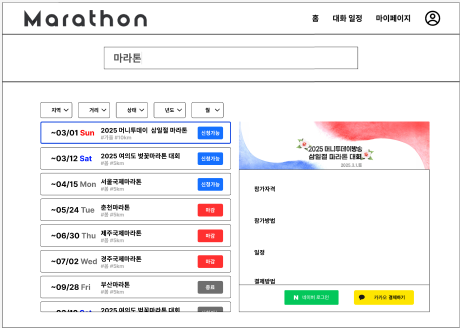

## 오늘의 목표
1. 프로젝트 아이디어 구체화
2. 마라톤 통합 관리 및 결제 서비스 피그마 작성

## 오늘 한 일
### 1. 아이디어 구체화
    - 마라톤 일정 관리 서비스
        - 기능 구체화 논의
            - 대회 조회 기능 제안
                - 대회 필터링 기능 제안
                - 결제 통합 및 편의성 기능 제안
        
        - 추후 서비스 개선 및 기능 추가 기획
            - 시각장애인을 위한 TTS 지원 서비스
            - 그룹별 실시간 마라톤 순위 서비스
            - 마라톤 랭크 시스템(페이스, 누적 거리)
    
        - 삼성 헬스 연동 방법 자료 조사
            - Samsung Health SDK Suite
            - Health Connect API

### 2. 마라톤 통합 관리 및 결제 서비스 피그마 작성
    - 메인 페이지 작성
        - 헤더
        - 검색 창
        - 대회 목록
        - 대회 필터링
        - 대회 상세보기
        - 결제 진행

### 3. 마라토너 설문 폼 작성 및 설문 준비
    - 마라토너들에게 필요한 기능이 무엇인지 파악하기 위한 설문 (질문) 작성
    - 러닝, 마라톤에 대한 관심도 조사 및 통계 파악

## 마치며
오늘은 마라톤 통합 관리 서비스의 방향성을 구체화하고 피그마로 시각화하며 아이디어를 한 단계 발전시킨 의미 있는 시간이었습니다.
(드디어 아이디어가 정해진 느낌...!)
오후 미팅때 컨설턴트님, 코치님께서 사용자 편의성을 높이기 위한 기능, 시각장애인을 위한 TTS 기능 등을 고려해보라고 하셨던 부분이 기억에 남습니다.
마지막으로 설문 폼 작성으로 잠재 사용자 의견을 수집할 기반을 마련하며, 실질적인 사용자 요구에 맞춘 서비스를 설계하는 능력을 기를 수 있었습니다.
