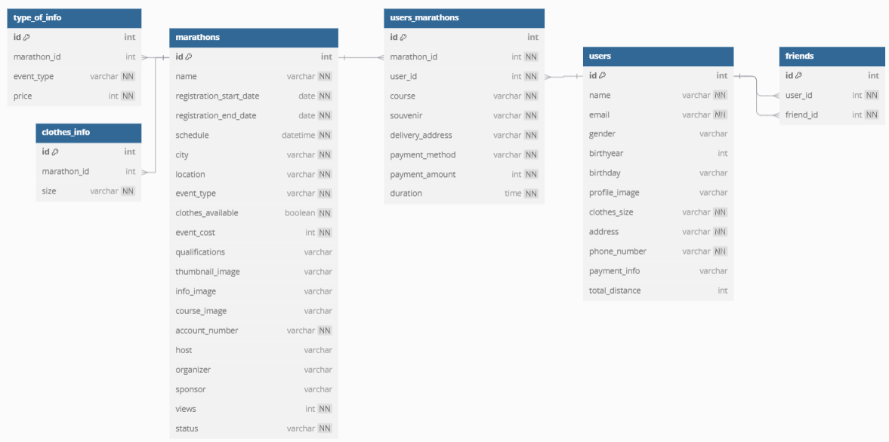

# 오늘 할 일
## 기능 명세서
- 기능 한 폼에 맞춰서 정리하기
## ERD
- 기능 명세서 확인 후 필요 데이터에 맞게 작성

## 컨설턴트님 미팅
- 일정표가 필요 !
- 워치 조금 더 직관적이고 다이나믹하게
## 일정 수립
- BE , FE 각자 일정 생성
## 인프라 코치님 세션
- Docker, Jenkins, Nginx 파헤치기
## 이슈 정리
- 홰결해야할 이슈 문제가 많아서 해결법 각각  찾아보기
# 연휴 간 할 일
## 오픈 뱅킹 API
- 계좌이체 API 테스트
- 계좌조회 API 테스트
- 관련 로직 어떻게 할 지 정리하기
## 유저
- 카카오 OAuth
- CRUD 정리
## 카카오 페이
- API 연동 확인
