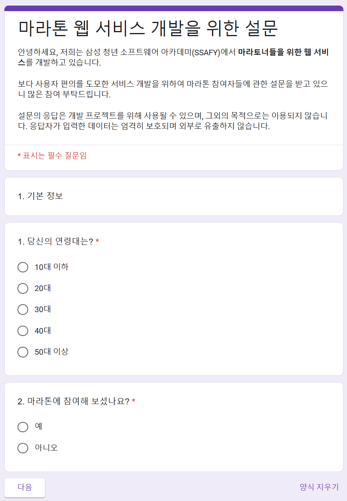
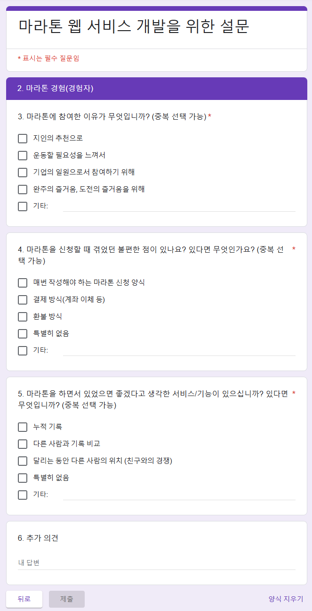
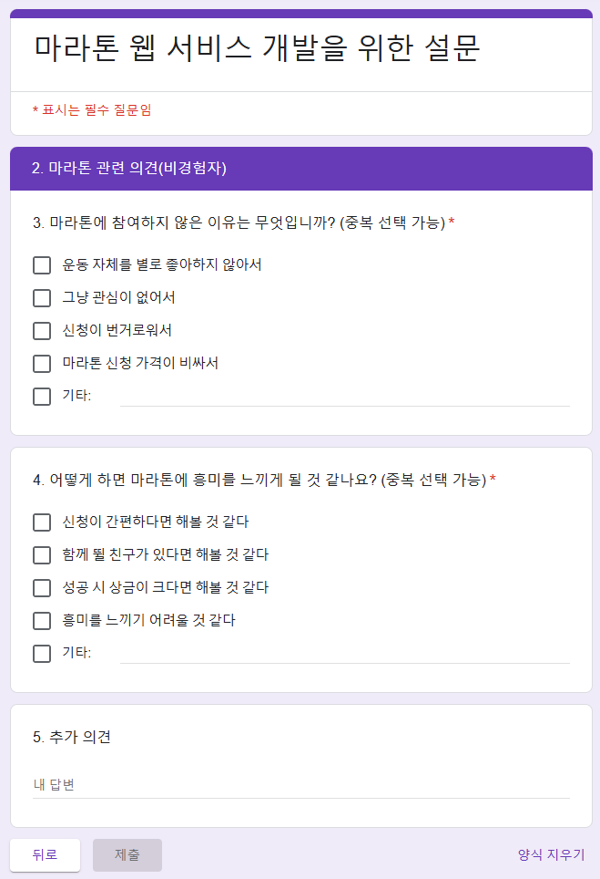

## 오늘 해야할 일
- 회고채널 만들기
- 오전에 평가하기
- 도메인 찾아보기
- 기획 구체화하기
- 자료 찾아보기

## 오늘 한 일
1. 평가하기
    - 오전 팀원 평가를 하며 팀원들에 대해 좀 더 자세히 생각해볼 수 있었음
2. 기획 구체화하기
    - 피그마 작업을 통해 본인이 생각하는 서비스의 모습을 그려보고, 이야기를 나눠봄
    - 다양한 관련 사이트를 찾아보며 어떻게 하는 것이 좋은지 알아봄
    - 오늘은 주로 다 같이 소통하며 의논하는 시간이 대체로 많았으며, 좀 더 구체화하기 위해 설문조사가 필요함을 느낌
3. 설문 조사 만들기
    - 실사용자가 될 사람들의 의견을 모아보기 위해 설문조사를 만듦
    
    
    

## 마치며
프로젝트에 대해 좀 더 명확하게 고민할 수 있게 되어서 정말 즐거웠습니다! 주말 동안 이 서비스를 어떻게 하면 계속해서 이용할지에 대한 고민을 해보며 프로젝트의 완성도가 올라갈 수 있도록 노력하겠습니다. 